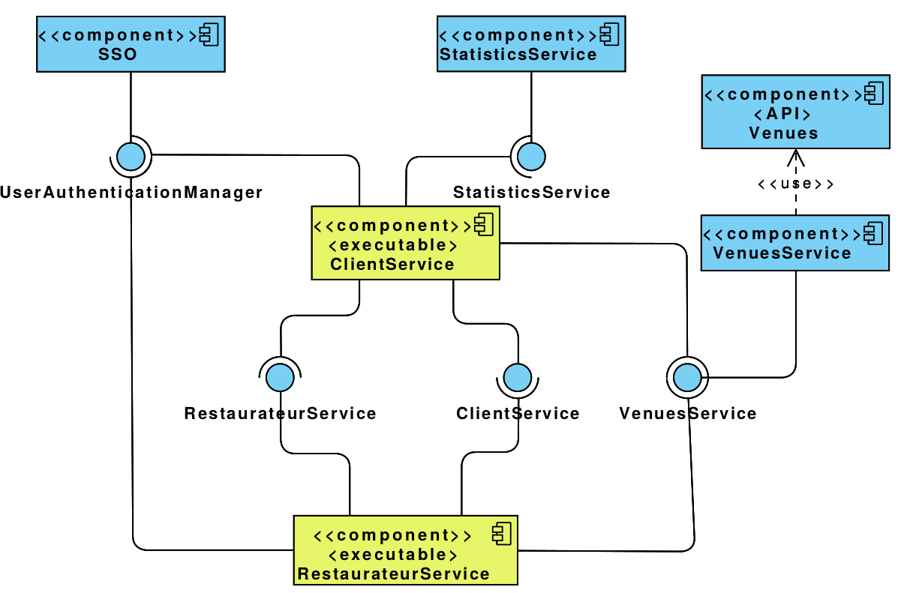

<b>Skład grupy:</b>

Maciej Kijko

Patryk Kleczkowski

Marek Kotulski

Adam Krupa

<b>
Dokumentacja projektowa
systemu informatycznego do rezerwacji stolików w restauracjach
</b>

W skład niniejszej dokumentacji wchodzą:
    
a) opis działania aplikacji (user story)

    
b) diagramy-  przypadków użycia, klas, komponentów, pakietów, sekwencji

    
c) diagramy -aktywności, stanów, wdrożenia

<b>Opis działania aplikacji (User story)</b>

<b>Aplikacja dla klienta:</b>

Niezalogowany klient

Użytkownik uruchamia aplikację, otrzymuje pytanie o udostępnienie lokalizacji – akceptuje je i wpisuje nazwę (nazwa lokalu, typ lokalu etc.) miejsca którego szuka i wyświetla mu się mapa z dopasowanymi wynikami. Restauracje są zaznaczone na mapie. Po kliknięciu na restaurację wyskakują informacje o niej oraz przycisk do rezerwacji stolika, który po kliknięciu otwiera okienko do zalogowania.

Zalogowany klient

Użytkownik uruchamia aplikację, otrzymuje pytanie o udostępnienie lokalizacji – akceptuje je i przechodzi do „Konto”, gdzie rejestruje się adresem e-mail i hasłem. Na podany adres e-mail otrzymuje link aktywacyjny, po którego kliknięciu zostaje przekierowany do strony główny i automatycznie zalogowany.
Użytkownik wyszukuje miejsce (podając przy tym promień), wyświetla mu się mapa z zaznaczonymi restauracjami. Po kliknięciu na restaurację, wyświetlony zostaje przycisk służący do zapytania o stolik, którym użytkownik może wysłać pytanie o dostępność stolika do restauracji. Po kliknięciu na przycisk otrzymuje okienko z formularzem szczegółów dotyczących stolika. Formularz stolika powinien pobierać informacje o liczbie miejsc, dacie, godzinie oraz ewentualnych uwagach od klienta. Po wysłaniu formularza, użytkownik oczekuje na odpowiedź od restauracji, którą otrzyma w skrzynce z powiadomieniami w prawym górnym rogu oraz na mailu. Aby stolik został zarezerwowany użytkownik musi potwierdzić rezerwację, co może zrobić przy powiadomieniu w skrzynce odbiorczej lub linkiem w wiadomości e-mail. Dopóki użytkownik nie potwierdzi rezerwacji stolik nie będzie zarezerwowany przez restaurację.

<b>Aplikacja dla restauracji</b>

Restaurator po wejściu do aplikacji, dostaje okienko gdzie może wybrać pomiędzy rejestracją, a logowaniem. W przypadku rejestracji, otrzymuje formularz w którym wpisuje swój adres e-mail, hasło, miasto i ulice lokalu. Po wpisaniu miasta i ulicy, w selekcie poniżej zostaną załadowane lokale odnalezione według podanych kryteriów. Użytkownik wybiera swój lokal i wysyła formularz rejestracji. Konto musi zostać aktywowane linkiem, który restaurator otrzymuje mailem. Po aktywacji zostaje automatycznie zalogowany.
Na stronie głównej użytkownik znajdzie tabelkę w której będą wiersze odpowiadające zapytaniom o stolik. Każdy wiersz będzie rozwijalny. Zwinięty wiersz będzie przedstawiał informację o dacie, godzinie oraz ilości osób – rozwinięty pokaże uwagi od pytającego. Przy każdym wierszu będą dwa przyciski do odpowiedzi na zapytanie (negatywna lub pozytywna). Po odpowiedzi na zapytanie, zapytanie znika z tabelki. W przypadku, gdy restauracja odpowie pozytywnie na zapytanie, restauracja oczekuje ostatecznego potwierdzenia rezerwacji od użytkownika. Gdy użytkownik potwierdzi rezerwację, informację o rezerwacji zostają zawarte w harmonogramie rezerwacji. Gdy użytkownik nie potwierdzi rezerwacji, nie dzieje się nic. Restaurator ma również możliwość przejścia do harmonogramu rezerwacji, gdzie znajdzie wszystkie potwierdzone rezerwacje i ich terminy.

Diagram przypadków użycia

Diagram klas

Diagram komponentów

Diagram pakietów

Diagram sekwencji

Diagram aktywności

Diagram stanów

Diagram wdrożenia

